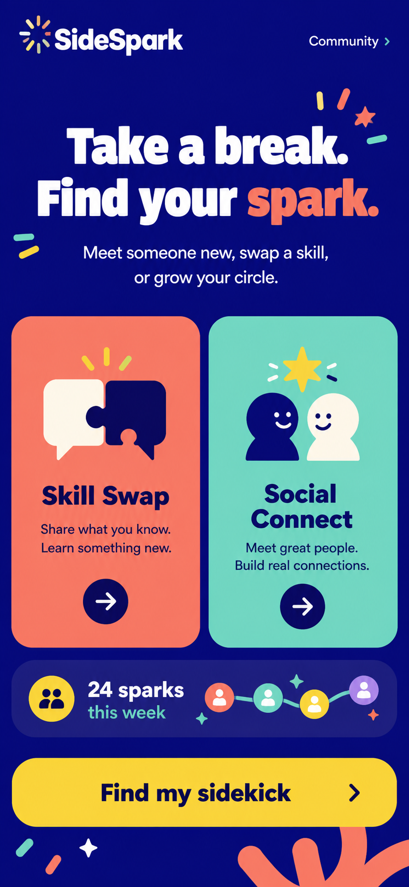

# SideSpark

**Take a break. Find your spark.**

[Try SideSpark](https://sidespark.tanveer-riaz.chatgpt.site) · [Read the story behind the build](https://tanveerriaz.me/blog/sidespark-started-with-a-conversation/)



SideSpark is a hackathon prototype for helping coworkers meet beyond their usual circles. It turns an ordinary Coffee, Walk, Lunch, or 15-minute Desk Break into a small shared activity.

The idea began with a conversation between Benny and me about how people can work in the same office for years without finding the skills and interests they have in common.

## How it works

1. Choose **Skill Swap** to learn or share something practical, or **Social Connect** to meet someone new.
2. Pick a break that fits your day.
3. Meet a fictional demo sidekick and get a short activity or conversation starter.
4. Finish the sidequest and save a small Spark Card on your device.

SideSpark uses the same clear matching rules every time and works with fictional demo profiles. It does not connect to a company directory, collect employee details, or send profile data anywhere. Progress stays on your device.

## Run it locally

```bash
npm install
npm run dev
```

To check the project:

```bash
npm test
npm run build
npm run test:sites
```

## License

SideSpark's source code is available under the [PolyForm Noncommercial License 1.0.0](LICENSE.md).

Commercial use by any person or organization—including using, modifying, deploying, incorporating, or distributing SideSpark for a commercial purpose—requires prior written approval and a separate commercial license from Tanveer Riaz. For permission or commercial licensing, contact [tanveer.riaz@hotmail.com](mailto:tanveer.riaz@hotmail.com).

The SideSpark name, logo, illustrations, screenshots, videos, design references, and other branded media assets are excluded from the software license and are covered by the separate [brand and media asset terms](ASSET-LICENSE.md). Third-party materials remain subject to their respective licenses and terms.

Built with React and Vite for the ChatGPT Sites Hackathon in Singapore.
